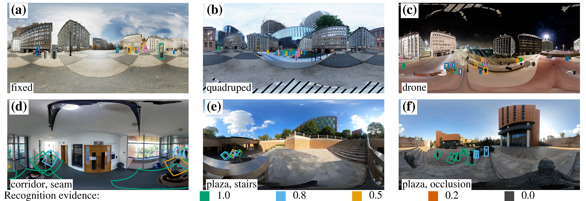

<div align="center">

# PanoPed

### Beyond Bounding Boxes for Sim-to-Real Panoramic Pedestrian Tracking

**A full-sphere benchmark and Sextant, a query-conditioned spherical localization readout**

[Project page](https://zhuqinfeng1999.github.io/PanoPed/) · [PanoPed-S](https://drive.google.com/drive/folders/1PjL8_KBVAmPNd1Zony2MQ9ogg1B7d2CR?usp=sharing) · [PanoPed-R](https://drive.google.com/drive/folders/1QYf_ocQALFYrwdfIa6g-bVwnnIQIXA9V?usp=sharing) · [Support-auto](https://drive.google.com/drive/folders/1zpZPpaFzvKcGMS_wfT3lX-uariYtm4Cg?usp=sharing)



</div>

**Short synthetic preview:** [drone-mounted ERP footage (MP4)](assets/drone_demo.mp4). The project page will host the full video introduction when the preprint goes online.

## What is here

PanoPed-S has 60 one-minute synthetic sequences (108,000 frames) from fixed, quadruped-mounted and drone-mounted cameras. PanoPed-R has five real fixed-camera sequences (28,002 frames), of which three are densely annotated (16,247 frames). Support-auto is a separate automatically derived real target; it is **not** a replacement for the original Box-fit labels.

Sextant reads a frozen 256-dimensional detector query, the initial spherical region, and the detection confidence. Its 34,692-parameter head predicts a four-dimensional localization correction. It changes the final spherical localization only; the detector's score, output count and tracker identities stay with the original tracker. The head does not add an image encoder or alter tracker history. The S-trained heads are evaluated on real Support-auto labels without fitting on real labels.

On PanoPed-S TEST, the reported MOTIP baseline is **47.30 HOTA**, versus **49.49 / 49.47** for two Sextant seeds. On real Support-auto, source-only HAT improves from **31.71 to 32.85 HOTA** for seed 42. These are distinct protocols and tracker backbones; they are not a single leaderboard.

## Repository map

| Path | Purpose |
|---|---|
| `src/panoped/sextant.py` | Exact frozen-query architecture and spherical residual encode/decode |
| `src/panoped/cli.py` | Portable bank-based training and inference |
| `tests/` | Zero-residual, seam-wrap and bank-contract checks |
| `docs/data.md` | Dataset packages, targets, release validation and licenses |
| `docs/integration.md` | Frozen MOTIP/HAT integration contract and fair comparison setup |
| `assets/` | Publication display figures; no dataset sequences or model weights |

The baseline trackers and detectors are **not vendored** here. Install and cite their official implementations under their own licenses. This repository contains the Sextant readout and a framework-neutral integration interface. The original experiment's bank creation and benchmark-evaluation receipts are described in `docs/integration.md`.

## Quick start

```bash
python -m venv .venv
source .venv/bin/activate
python -m pip install -e '.[test]'
pytest -q

# One .npz bank per TRAIN sequence; never mix a test sequence into this folder.
panoped-sextant train --bank-dir /path/to/train_banks --seed 42 \
  --steps 25000 --device cuda --output /path/to/checkpoints/sextant_s42.pt

# The bank must contain the same frozen detector's query, geometry and score.
panoped-sextant apply --bank /path/to/prediction_bank.npz \
  --model /path/to/checkpoints/sextant_s42.pt \
  --output /path/to/prediction_native.npz
```

`train` expects `query[N,256]`, `base[N,7]`, `confidence[N]`, and `native[N,7]` in finite `float32` arrays, one `.npz` per training sequence. `base` and `native` each contain a unit center ray, log horizontal/vertical angular extents, and the fixed zero-roll release fields. `apply` needs only the first three arrays and passes through additional arrays such as original track IDs and frame offsets. See [the interface contract](docs/integration.md) before connecting it to a tracker.

## Data and evaluation

Download datasets **directly to your compute server**, validate package checksums, extract only the modalities you need, then remove verified archives if space is limited. The package manifests and verification scripts accompany the releases. See [data.md](docs/data.md) for source links and target distinctions. Do not redistribute participant frames outside the PanoPed-R license.

The benchmark uses native spherical regions and HOTA/IDF1; a planar box metric is not a substitute. Report all seeds and all held-out sequences, and keep PanoPed-S, PanoPed-R Box-fit and PanoPed-R Support-auto scores separate. The real three-fold protocol trains on two labeled sequences and scores the third once per fold.

## Citation

The arXiv identifier is pending. Please cite the paper once it is posted. This repository remains private until the authors announce the preprint.

## License and provenance

The authors have selected [Creative Commons Attribution-NonCommercial-ShareAlike 4.0 International](LICENSE) for the code and repository-authored text. It permits noncommercial reuse subject to attribution and share-alike, but it is **not** an OSI open-source software license, and Creative Commons does not recommend CC licenses for software. The datasets have separate research-use licenses; those terms do **not** automatically grant permission to relicense participant images, third-party assets, or baseline code. The publication figures derive from consented real footage and Unreal Engine renders and are not included in the code-license grant unless their underlying rights permit it. No raw dataset frames, credentials, model weights, or third-party baseline repositories are included here.
