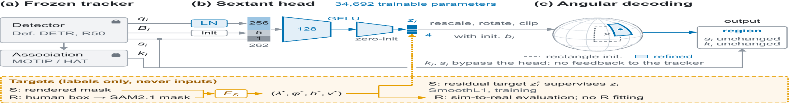

<div align="center">

# PanoPed

### Beyond Bounding Boxes for Sim-to-Real Panoramic Pedestrian Tracking

**Full-sphere pedestrian tracking from fixed cameras, quadrupeds, and drones**

[](docs/data.md#panoped-s-v100) [](docs/data.md#panoped-r-v090) [](#sextant) [](LICENSE)

[**Project page**](https://zhuqinfeng1999.github.io/PanoPed/) · [**Synthetic data**](https://drive.google.com/drive/folders/1PjL8_KBVAmPNd1Zony2MQ9ogg1B7d2CR?usp=sharing) · [**Real data**](https://drive.google.com/drive/folders/1QYf_ocQALFYrwdfIa6g-bVwnnIQIXA9V?usp=sharing) · [**Support-Auto**](https://drive.google.com/drive/folders/1zpZPpaFzvKcGMS_wfT3lX-uariYtm4Cg?usp=sharing)


<sub>Top: synthetic fixed, quadruped, and drone views with native annotations. Bottom: consented real frames with box-prompted automatic Support-Auto masks; these are not manually drawn pixel labels.</sub>

</div>

> **Release status.** This repository is private while the arXiv page and public release are prepared. The Google Drive links are the author-provided package locations. Check access and the release-specific license before redistribution. Paper and video-introduction links will be added after posting.

## Start here

| I want to… | Go to |
|---|---|
| Download only the RGB and labels needed for tracking | [Download and verify the three releases](docs/download.md) |
| Understand the directory tree and annotation fields | [Dataset formats](docs/data.md) |
| Train or apply the Sextant readout | [Quick start](#quick-start) and [integration contract](docs/integration.md) |
| Compare trackers fairly | [Protocols and evaluation](docs/integration.md#evaluation-protocols) |
| See representative video | [Synthetic drone ERP preview](assets/drone_demo.mp4); full introduction pending |

## What is PanoPed?

| Release | Cameras | Scale | Primary target | Download |
|---|---|---:|---|---|
| **PanoPed-S v1.0.0** | 30 fixed, 18 quadruped, 12 drone | 60 × 1 min; 108,000 frames | Mask-derived spherical visible support | [Packages](https://drive.google.com/drive/folders/1PjL8_KBVAmPNd1Zony2MQ9ogg1B7d2CR?usp=sharing) |
| **PanoPed-R v0.9.0** | Five real fixed-camera sequences | 28,002 frames; 16,247 labeled | Human modal box → spherical **Box-fit** | [Packages](https://drive.google.com/drive/folders/1QYf_ocQALFYrwdfIa6g-bVwnnIQIXA9V?usp=sharing) |
| **R-Support-Auto v0.1** | Same three labeled real sequences | Annotation-only extension | Human-box-prompted SAM2.1 mask → S-compatible support | [Extension](https://drive.google.com/drive/folders/1zpZPpaFzvKcGMS_wfT3lX-uariYtm4Cg?usp=sharing) |

The two real targets are **different evaluation protocols**. Support-Auto does not overwrite PanoPed-R's manually reviewed modal rectangles or original Box-fit leaderboard. See [the exact file trees and fields](docs/data.md).

## Sextant

<div align="center"></div>

Sextant is a **34,692-parameter final-location readout**. It takes a frozen 256D detector query, the ordinary spherical initialization, and detection confidence. LayerNorm is applied to the query alone; the concatenated 262D input passes through a 128D GELU hidden layer and a four-value angular residual. It changes the final native spherical region without changing detection count, scores, physical track IDs, association, or tracker history. It does **not** add an image encoder to inference.

In the paper's **PanoPed-S TEST** comparison, MOTIP's ordinary readout obtains 47.30 HOTA; two Sextant seeds obtain **49.49 / 49.47**. In the distinct **source-only real Support-Auto** protocol, HAT's same-stream readout goes from 31.71 to **32.85 HOTA** with Sextant seed 42. These figures use different trackers and targets and must not be merged into a single leaderboard.

### Quick start

```bash
python -m venv .venv
source .venv/bin/activate
python -m pip install -e '.[test]'
pytest -q

# Export one .npz bank per TRAIN sequence using your frozen, matching detector.
panoped-sextant train --bank-dir /path/to/train_banks --seed 42 \
  --steps 25000 --device cuda --output /path/to/checkpoints/sextant_s42.pt

panoped-sextant apply --bank /path/to/prediction_bank.npz \
  --model /path/to/checkpoints/sextant_s42.pt \
  --output /path/to/prediction_native.npz
```

The bank contract is `query[N,256]`, `base[N,7]`, `confidence[N]`, and, for training, `native[N,7]` (`float32`). `apply` passes through unrelated arrays, including IDs and frame offsets. The bank must come from the **matching detector checkpoint**; a same-sized HAT or MASA feature is not a substitute for the S-trained MOTIP query. [Read the full integration contract](docs/integration.md) before connecting a tracker.

## Repository map

```text
PanoPed/
├── README.md                  project overview and entry points
├── LICENSE                    repository code/text terms (CC BY-NC-SA 4.0)
├── pyproject.toml             installable Sextant package and CLI
├── assets/                    publication figures and short video preview
├── docs/
│   ├── download.md            release URLs, selective extraction, verification
│   ├── data.md                trees, units, L0–L3, Support-Auto record schema
│   └── integration.md         query contract, training, evaluation protocols
├── src/panoped/
│   ├── sextant.py             architecture and angular residual decode
│   └── cli.py                 bank-based train/apply commands
└── tests/                     zero residual, seam, and bank-contract checks
```

MOTIP, HAT, detectors, checkpoints, and benchmark RGB are **not vendored**. Install the upstream trackers under their own licenses. The private draft currently provides the Sextant module and a framework-neutral bank interface; the experiment-specific bank exporter and checkpoint manifests still need a clean release adapter. We will not describe it as a one-command exact reproduction until those files are published.

## Citation and permissions

The arXiv identifier is pending. Cite the paper once posted; until then, cite dataset release names and versions. The repository-authored code and text use [CC BY-NC-SA 4.0](LICENSE), a noncommercial Creative Commons license **not recognized as an OSI open-source software license**. It does not relicense participant footage, third-party assets, baseline implementations, or model weights. Each dataset package carries its own `LICENSE`, attribution, and release metadata; read those before use.
